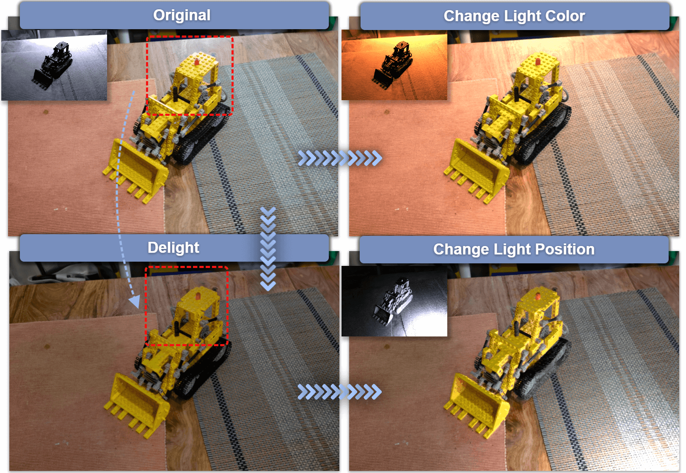

# 
 GS-ID: Illumination Decomposition on Gaussian Splatting 

#####  
 [Kang Du](https://kangdu.top/), [Zhihao Liang](https://lzhnb.github.io/), [Zeyu Wang](https://facultyprofiles.hkust-gz.edu.cn/faculty-personal-page/WANG-Zeyu/zeyuwang)

#### 
[Project Page](https://kangdu.top/gsid/) | [ArXiv](https://#) | [Paper](https://#)

## Introduction
We present GS-ID, a novel framework for illumination decomposition on Gaussian Splatting, achieving photorealistic novel view synthesis and intuitive light editing.

  
  

I am working on releasing the code. Please contact me if you have any questions at: kdu800@connect.hkust-gz.edu.cn
